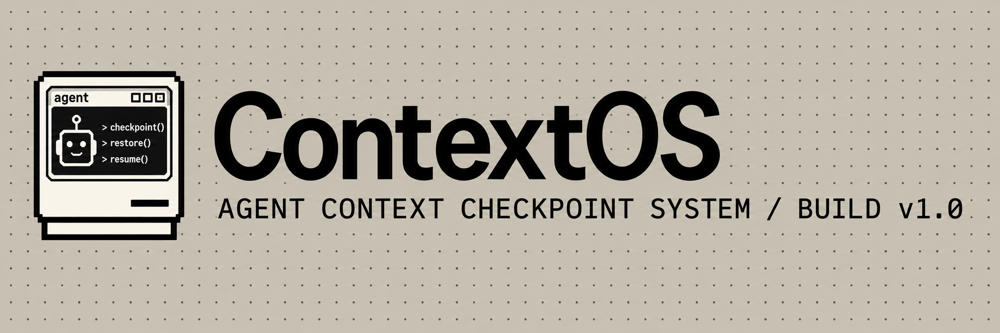

<p align="center">
  
</p>

ContextOS is a stateful runtime for long-horizon AI agents that turns growing histories into compact, mutable context checkpoints. The transcript is an event log; the authoritative working state is `data/state.json`.

## Why Checkpoints?

Video games preserve progress through checkpoints instead of replaying everything that happened before them. ContextOS applies the same idea to long-running agents: it converts growing history into structured context points—facts, decisions, constraints, open tasks, and next actions—and checkpoints that state so a fresh worker can resume without replaying the full transcript.

```text
History → ContextOS → Context points → Savepoint → Fresh worker → Continue
```

The [controlled Roblox checkpoint demo](docs/ROBLOX_DEMO.md) uses an FPS map mission to show real savepoint persistence, exact worker PID death, zero-event restore, mission continuation, state diffs, and Autopsy. The Roblox map observations are deterministic; ContextOS does not control Roblox Studio. The existing 120-step benchmark measures 20,603 estimated history tokens versus 210 active-context tokens. Liquid and Nimble have been verified live in a separate revalidation run.

## Deterministic demo

```bash
npm install
npm run contextos:demo
npm run dev
```

Open <http://localhost:3000>. Use **Reset**, **Advance turn**, or **Run scenario** to replay the API migration. DEMO mode is always available and uses deterministic First Brain and Second Brain providers.

## Live providers

Copy `.env.example` to `apps/web/.env.local` and fill in both brain provider settings. Use `openai` for the official API, `openai-compatible` for a compatible hosted or local endpoint, or `liquid` to label a Liquid model served through the same HTTP interface. Set `CONTEXTOS_MODE=LIVE` to seed a fresh live scenario on a new data directory. The dashboard can switch between configured LIVE and DEMO modes; switching resets the scenario explicitly.

```bash
npm run contextos:live
npm run dev
```

`npm run contextos:live` runs all three scenario turns. For an existing local model, see [optional Liquid setup](docs/LIQUID_LOCAL.md). No key or model download is needed for the deterministic demo. Provider keys stay server-side and are never serialized into state or events.

## Architecture

`FirstBrainProvider` receives compiled canonical state plus one task and produces a worker event. `SecondBrainProvider` observes that event and returns JSON mutation proposals. The runtime parses and validates the complete set before deterministic core code applies any proposal. Each accepted mutation increments `stateVersion`, writes an atomic state snapshot, and appends a semantic diff and audit events. The next turn compiles current active state and only a few recent events.

`data/state.json` is canonical; `data/events.jsonl` and `data/diffs.jsonl` are historical logs. Context size estimates use four characters per token. Provider-reported token usage is stored separately when available. The dashboard's “not sent to model” estimate compares raw event history with the compiled working context at the last First Brain request.

## Final demo

```bash
npm run contextos:demo
npm run contextos:recovery-demo
npm run contextos:autopsy-demo
npm run contextos:roblox-demo
npm run contextos:benchmark
npm run dev
```

The dashboard links to **Context**, **Recovery**, **Checkpoint Demo**, **Autopsy**, and **Benchmark** sections. Its controls run real local operations. The recovery demo kills its owned worker PID, starts a fresh process, verifies a savepoint, and continues the mission. The Autopsy scenario records a controlled deployment failure and traces it to a persisted state diff. The benchmark runs 120 deterministic steps with one event stream for both payload constructions. See [recovery](docs/RECOVERY.md), [Autopsy](docs/AUTOPSY.md), [controlled Roblox presentation](docs/ROBLOX_DEMO.md), and [telemetry and benchmark](docs/FINAL_DEMO.md).

Optional RawTree settings are in `.env.example`. RawTree mirrors structured telemetry and never stores canonical state. With no key, the dashboard reports **NOT CONFIGURED**.

## Sponsor integrations

- **Liquid AI:** Preferred LIVE Second Brain for lightweight context maintenance through the existing OpenAI-compatible provider. Its proposals still pass runtime validation and the deterministic mutation engine.
- **Nimble:** Optional fresh web evidence for the Fact Inspector's stale-memory revalidation. Evidence becomes an event before Second Brain analysis; Nimble never writes canonical state.
- **RawTree:** Optional external mirror for structured runtime telemetry and long-run analytics. Local files remain authoritative.
- **AWS:** S3 savepoint mirroring is a possible durability extension, not implemented or required for the demo.

Run `npm run contextos:revalidate-demo` for the deterministic v1 → v2 evidence flow, and `npm run contextos:sponsors` to inspect configuration without printing keys. See [sponsor setup](docs/SPONSORS.md) and the [live verification record](docs/LIVE_VERIFICATION.md) for actual provider results. Liquid and Nimble are live verified through ContextOS; OpenAI returned HTTP 403, and RawTree awaits access configuration.

## Checks

```bash
npm run lint
npm run typecheck
npm test
npm run build
```

For a production server, run `npm run start` after the build. The local runtime uses file storage behind the `StateStorage` interface; recovery uses a separate disposable worker process.
